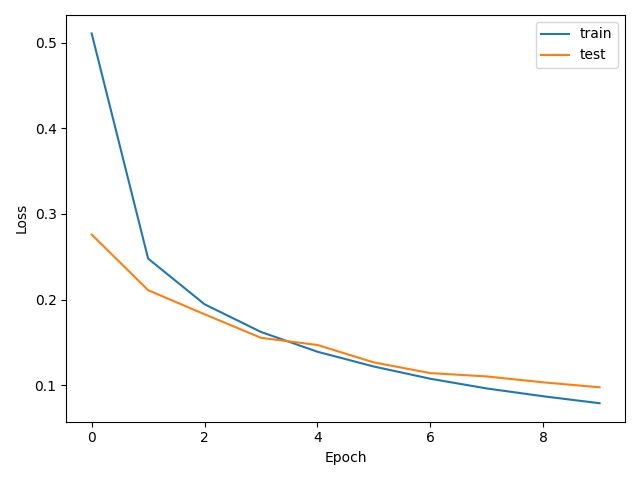
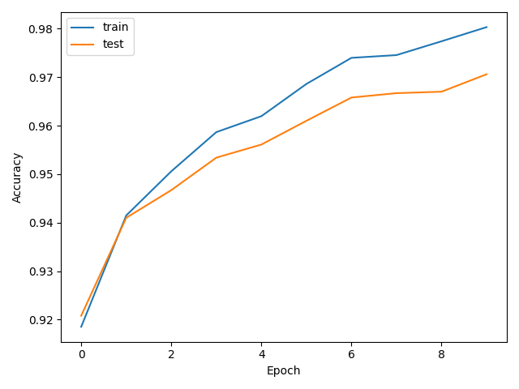
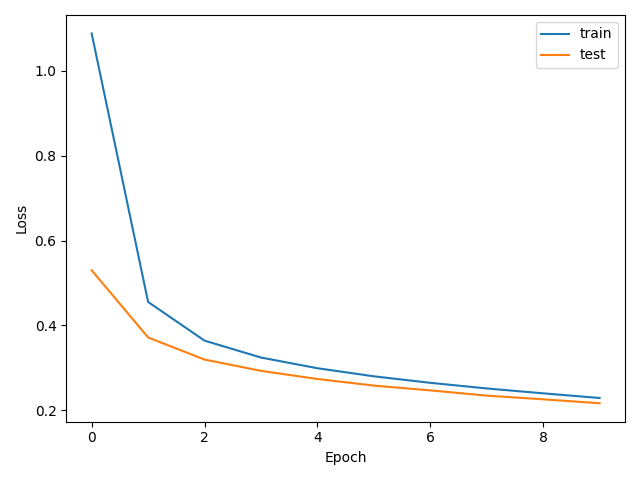
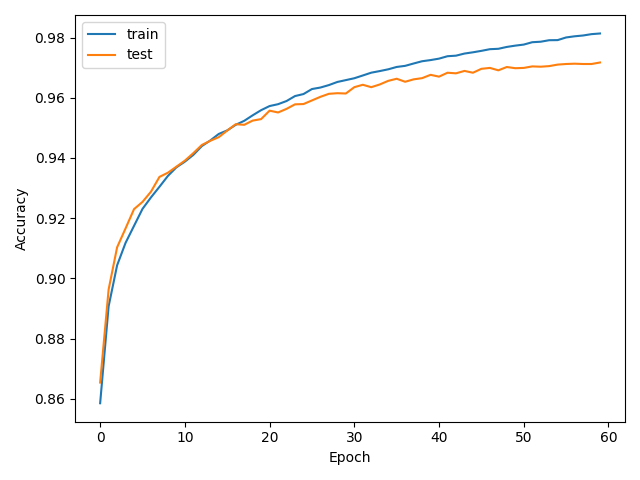

# MLP do zero para classificação do MNIST

## Contexto do projeto

Este projeto apresenta a implementação de um Multi-Layer Perceptron (MLP) para a classificação dos dez dígitos manuscritos do conjunto de dados MNIST. A rede neural foi construída sem o uso de frameworks de deep learning para os cálculos do modelo. Operações como inicialização dos parâmetros, forward pass, cálculo da função de perda, backpropagation e atualização dos pesos foram implementadas manualmente com NumPy.

A principal motivação dessa abordagem foi compreender o funcionamento interno de uma rede neural multicamada. Em vez de utilizar uma classe pronta de treinamento, o projeto mantém explícitas as etapas que transformam as imagens de entrada em probabilidades, calculam o erro das previsões e propagam esse erro de volta pela rede.

O conjunto MNIST é carregado por meio do `torchvision`, utilizado somente para obtenção dos dados. O treinamento e a inferência do modelo não utilizam recursos de redes neurais do PyTorch. Essa escolha foi necessária porque o ambiente de desenvolvimento usa Python 3.14.3, versão para a qual o TensorFlow não estava disponível durante o desenvolvimento.

## Objetivo

O objetivo principal é classificar imagens de dígitos manuscritos com acurácia mínima de 92% no conjunto de teste. Para isso, a implementação deve atender aos seguintes requisitos:

- possuir ao menos duas camadas ocultas;
- aplicar ReLU nas camadas ocultas;
- utilizar softmax na camada de saída;
- calcular o erro por cross-entropy;
- implementar o backpropagation manualmente;
- treinar com mini-batches e Stochastic Gradient Descent (SGD);
- permitir arquiteturas com diferentes quantidades e tamanhos de camadas;
- registrar as curvas de loss e acurácia;
- comparar ao menos duas configurações experimentais.

## Estrutura do repositório

```text
.
├── experiments/
│   ├── experimento_1.py
│   └── experimento_2.py
├── mlp/
│   ├── __init__.py
│   ├── activations.py
│   ├── losses.py
│   ├── network.py
│   ├── optimizers.py
│   └── utils.py
├── results/
│   ├── experimento_1/
│   └── experimento_2/
├── ITL_EC06_1B_2026_S7_ponderada.ipynb
├── README.md
├── requirements.txt
└── train.py
```

## Divisão de responsabilidades

A implementação foi dividida para que cada arquivo possua uma responsabilidade específica. Essa separação permite alterar a arquitetura ou os hiperparâmetros dos experimentos sem duplicar a lógica matemática da rede.

| Arquivo | Responsabilidade |
|---|---|
| `mlp/activations.py` | Implementa ReLU, derivada da ReLU e softmax. |
| `mlp/losses.py` | Implementa a cross-entropy usada para medir o erro das previsões. |
| `mlp/optimizers.py` | Implementa o SGD e a atualização dos parâmetros. |
| `mlp/utils.py` | Converte rótulos inteiros para a representação one-hot. |
| `mlp/network.py` | Inicializa a rede e executa forward pass, backpropagation, treinamento, predição e avaliação. |
| `mlp/__init__.py` | Expõe `MLP` e `one_hot` como elementos principais do pacote. |
| `train.py` | Carrega e prepara o MNIST, executa os experimentos e salva métricas e gráficos. |
| `experiments/experimento_1.py` | Define os hiperparâmetros e o diretório de resultados do primeiro experimento. |
| `experiments/experimento_2.py` | Define os hiperparâmetros e o diretório de resultados do segundo experimento. |
| `results/` | Armazena históricos, resumos e gráficos produzidos durante os treinamentos. |

O fluxo de execução parte de um arquivo em `experiments/`, que envia sua configuração para `run_experiment`, em `train.py`. Essa função prepara os dados, cria uma instância de `MLP` e inicia o treinamento. A classe `MLP`, por sua vez, utiliza as ativações, a função de perda e o otimizador presentes nos demais módulos.

```text
experiments/experimento_n.py
             ↓
      train.run_experiment
             ↓
        mlp.network.MLP
             ↓
 activations + losses + SGD
             ↓
    results/experimento_n/
```

## Preparação dos dados

O MNIST possui 60.000 imagens de treinamento e 10.000 imagens de teste. Cada imagem originalmente possui dimensão `28 x 28` e valores de pixel entre 0 e 255.

Antes do treinamento, as imagens passam por duas transformações:

1. cada matriz `28 x 28` é convertida para um vetor com 784 posições;
2. os valores são divididos por 255, passando para o intervalo entre 0 e 1.

Os rótulos são recebidos como números inteiros entre 0 e 9. Durante o treinamento, eles são convertidos para one-hot. Por exemplo, o dígito 3 passa a ser representado como:

```text
[0, 0, 0, 1, 0, 0, 0, 0, 0, 0]
```

## Funcionamento do MLP

### Inicialização dos parâmetros

Os pesos são inicializados com a estratégia de He. Para uma camada com `fan_in` entradas, o desvio utilizado na distribuição normal é calculado por:

```text
sqrt(2 / fan_in)
```

Essa inicialização foi escolhida por ser adequada ao uso da ReLU. Os bias são inicializados com zero. A seed configurável permite reproduzir os mesmos parâmetros iniciais e comparar experimentos em condições semelhantes.

### Forward pass

Em cada camada oculta, a rede calcula:

```text
Z = A_anterior @ W + b
A = ReLU(Z)
```

Na última camada, os logits são transformados em probabilidades pelo softmax. Para evitar instabilidade numérica, o maior logit de cada amostra é subtraído antes da exponenciação:

```text
softmax(x) = exp(x - max(x)) / sum(exp(x - max(x)))
```

As ativações e pré-ativações são armazenadas temporariamente porque serão reutilizadas no backpropagation.

### Cross-entropy

A cross-entropy compara as probabilidades previstas com os rótulos corretos:

```text
loss = -mean(sum(y_true * log(y_pred)))
```

As probabilidades são limitadas numericamente antes do logaritmo para evitar operações como `log(0)`.

### Backpropagation

Como a saída combina softmax e cross-entropy, o gradiente inicial pode ser calculado diretamente por:

```text
delta = (y_pred - y_true) / batch_size
```

Em seguida, a rede percorre as camadas na ordem inversa. Para cada camada, são calculados:

```text
dW = A_anterior.T @ delta
db = sum(delta)
```

Nas camadas ocultas, o erro é propagado pelos pesos da camada seguinte e multiplicado elemento a elemento pela derivada da ReLU:

```text
delta = (delta @ W.T) * ReLU'(Z)
```

### Atualização com SGD

Após o cálculo dos gradientes, pesos e bias são atualizados pelo SGD:

```text
parametro = parametro - learning_rate * gradiente
```

O treinamento divide os dados em mini-batches. A cada época, as amostras são embaralhadas, processadas em lotes e utilizadas para atualizar os parâmetros.

## Como executar

### Instalação

O projeto foi desenvolvido com Python 3.14.3. Para instalar as dependências:

```powershell
python -m pip install -r requirements.txt
```

As dependências principais são:

- `numpy`, para os cálculos matriciais do MLP;
- `torch` e `torchvision`, somente para carregamento do MNIST;
- `matplotlib`, para geração dos gráficos;
- `jupyter`, para abertura do notebook de instruções.

Na primeira execução, o `torchvision` baixa o MNIST para a pasta local `data/`.

### Primeiro experimento

```powershell
python -m experiments.experimento_1
```

### Segundo experimento

```powershell
python -m experiments.experimento_2
```

### Configuração manual

Também é possível executar `train.py` diretamente e informar os hiperparâmetros:

```powershell
python train.py --hidden-layers 256,128 --epochs 10 --batch-size 128 --learning-rate 0.05
```

Os principais argumentos disponíveis são:

| Argumento | Finalidade |
|---|---|
| `--hidden-layers` | Define os tamanhos das camadas ocultas separados por vírgula. |
| `--epochs` | Define a quantidade de épocas. |
| `--batch-size` | Define a quantidade de amostras por mini-batch. |
| `--learning-rate` | Define a taxa de aprendizado do SGD. |
| `--seed` | Define a seed da inicialização e do embaralhamento. |
| `--train-limit` | Limita a quantidade de amostras de treinamento para testes rápidos. |
| `--test-limit` | Limita a quantidade de amostras de teste. |
| `--results-dir` | Define a pasta em que os resultados serão salvos. |

## Arquiteturas escolhidas

### Experimento 1

O primeiro experimento foi utilizado como configuração de referência. A rede possui 784 entradas, duas camadas ocultas com 256 e 128 neurônios e uma saída com 10 classes.

```text
[784, 256, 128, 10]
```

| Hiperparâmetro | Valor |
|---|---:|
| Camadas ocultas | 256 e 128 |
| Épocas | 10 |
| Batch size | 128 |
| Learning rate | 0,05 |
| Seed | 42 |
| Parâmetros treináveis | 235.146 |

Essa configuração obteve um bom resultado em poucas épocas e serviu como referência para avaliar as alterações do segundo experimento.

### Experimento 2

O segundo experimento foi criado inicialmente com uma arquitetura menor, composta por camadas ocultas de 128 e 64 neurônios. A configuração inicial utilizava 10 épocas, batch size de 128 e learning rate de 0,01, alcançando 93,71% de acurácia.

Após os ajustes incrementais, a configuração final registrada no repositório passou a utilizar:

```text
[784, 192, 94, 10]
```

| Hiperparâmetro | Valor |
|---|---:|
| Camadas ocultas | 192 e 94 |
| Épocas | 90 |
| Batch size | 64 |
| Learning rate | 0,05 |
| Seed | 42 |
| Parâmetros treináveis | 169.812 |

A ampliação da arquitetura ocorreu depois que os ganhos obtidos apenas pelo aumento do número de épocas começaram a diminuir. A configuração final aumentou a capacidade de representação da rede e produziu o melhor resultado do projeto.

## Evolução do segundo experimento

O segundo experimento foi modificado de forma incremental. Em um primeiro momento, somente o número de épocas foi aumentado. Essa estratégia elevou a acurácia rapidamente, mas os ganhos passaram a ser pequenos após aproximadamente 70 épocas.

Posteriormente, o batch size foi reduzido de 128 para 64. Com batches menores, a rede passou a realizar mais atualizações dos parâmetros por época. Em seguida, o learning rate foi elevado de 0,01 para 0,05, acelerando a otimização. Por fim, o treinamento foi reduzido para 90 épocas e a arquitetura foi ampliada.

| Etapa | Camadas ocultas | Épocas | Batch | Learning rate | Loss de teste | Acurácia de teste |
|---|---|---:|---:|---:|---:|---:|
| Configuração inicial | 128, 64 | 10 | 128 | 0,01 | 0,2168 | 93,71% |
| Aumento de épocas | 128, 64 | 50 | 128 | 0,01 | 0,1005 | 96,98% |
| Aumento de épocas | 128, 64 | 60 | 128 | 0,01 | — | 97,17% |
| Aumento de épocas | 128, 64 | 70 | 128 | 0,01 | — | 97,41% |
| Retorno decrescente | 128, 64 | 120 | 128 | 0,01 | 0,0754 | 97,67% |
| Redução do batch | 128, 64 | 120 | 64 | 0,01 | 0,0775 | 97,92% |
| Aumento do learning rate | 128, 64 | 120 | 64 | 0,05 | 0,0943 | 97,97% |
| Redução do treinamento | 128, 64 | 90 | 64 | 0,05 | 0,0937 | 98,00% |
| Arquitetura final | 192, 94 | 90 | 64 | 0,05 | 0,0878 | **97,99%** |

Esse processo mostra que apenas aumentar o número de épocas não era suficiente para manter ganhos relevantes. As alterações no batch size, no learning rate e na capacidade da rede tiveram impacto maior no resultado final.

## Resultados

Os dois experimentos superaram a meta mínima de 92% de acurácia.

| Experimento | Arquitetura | Épocas | Batch | Learning rate | Loss de teste | Acurácia de teste |
|---|---|---:|---:|---:|---:|---:|
| Experimento 1 | 784-256-128-10 | 10 | 128 | 0,05 | 0,0975 | 97,06% |
| Experimento 2 | 784-192-94-10 | 90 | 64 | 0,05 | **0,0878** | **97,99%** |

O segundo experimento apresentou uma melhoria de 0,93 ponto percentual em relação ao primeiro. No conjunto de teste com 10.000 imagens, essa diferença corresponde a aproximadamente 93 classificações corretas adicionais.

### Curvas do experimento 1





### Curvas do experimento 2





Cada pasta de resultados também contém:

- `history.json`, com as métricas de todas as épocas;
- `history.csv`, com o mesmo histórico em formato tabular;
- `summary.json`, com a configuração e as métricas finais;
- `loss.png`, com as curvas de loss;
- `accuracy.png`, com as curvas de acurácia.

## Decisões e dificuldades

### Qual foi a decisão técnica mais difícil que eu tomei?

A decisão técnica mais difícil foi determinar quando parar de aumentar o número de épocas e começar a modificar outros hiperparâmetros. A configuração inicial do segundo experimento tinha acurácia de 93,71%, e aumentar as épocas trouxe melhorias claras no começo. No entanto, depois de vários testes, percebi que os ganhos estavam ficando cada vez menores e que a acurácia de treinamento se aproximava de 100%, enquanto a acurácia de teste oscilava.

Eu decidi manter os experimentos separados e alterar os parâmetros de forma incremental. Primeiro aumentei as épocas, depois reduzi o batch size, aumentei o learning rate e, por último, modifiquei a arquitetura. Essa escolha tornou mais fácil relacionar cada mudança ao resultado observado e deixou o histórico de commits mais representativo do processo de desenvolvimento.

### O que eu tentei que não funcionou como esperado? O que aprendi?

Minha primeira tentativa de melhorar o segundo experimento foi continuar aumentando o número de épocas em intervalos de dez. Essa estratégia funcionou inicialmente, levando a rede de 93,71% para resultados acima de 97%. Entretanto, entre 70 e 120 épocas, as métricas passaram a mudar muito pouco. Aprendi que aumentar o tempo de treinamento não garante uma melhoria proporcional e pode aproximar a rede do sobreajuste.

Também tentei instalar o TensorFlow para carregar o MNIST, mas não havia uma distribuição compatível com o Python 3.14.3 utilizado no projeto. Por isso, passei a usar `torchvision.datasets.MNIST`. O `torchvision` ficou restrito ao carregamento do conjunto de dados, enquanto toda a implementação e os cálculos da rede continuaram sendo feitos com NumPy.

Outro aprendizado foi que a acurácia e a cross-entropy não precisam melhorar exatamente na mesma proporção. Em uma das configurações, a acurácia aumentou enquanto a loss também aumentou levemente. Isso ocorre porque a cross-entropy considera o nível de confiança das probabilidades, enquanto a acurácia verifica somente se a classe escolhida está correta.

### Se eu fosse refazer do zero, o que faria diferente?

Se eu refizesse o projeto, começaria definindo uma matriz de experimentos com valores planejados para épocas, batch size, learning rate e arquitetura. Isso reduziria a quantidade de treinamentos baseados apenas em incrementos sucessivos e facilitaria uma comparação mais sistemática.

Eu também separaria parte do conjunto de treinamento para validação e manteria o conjunto de teste isolado até a escolha final do modelo. Neste projeto, as métricas do conjunto de teste foram acompanhadas durante os ajustes, o que foi útil para a atividade, mas uma avaliação mais rigorosa utilizaria treino, validação e teste como conjuntos distintos.

Além disso, eu implementaria gradient check numérico antes dos treinamentos completos, testes unitários para as ativações e derivadas, salvamento dos melhores pesos e early stopping. Essas ferramentas tornariam a validação do backpropagation mais objetiva e evitariam continuar o treinamento depois que a melhor acurácia de validação já tivesse sido alcançada.

## Limitações e possíveis melhorias

Embora os objetivos obrigatórios tenham sido atendidos, algumas extensões não foram implementadas:

- gradient check numérico;
- otimizadores com momentum, RMSProp ou Adam;
- matriz de confusão;
- visualização de embeddings com PCA ou t-SNE;
- testes unitários;
- salvamento e carregamento dos pesos;
- early stopping.

Esses itens representam caminhos possíveis para continuar o desenvolvimento sem alterar a implementação central do MLP.
